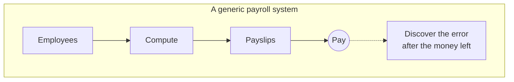
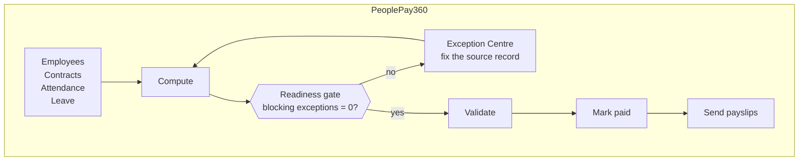
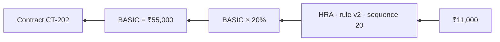
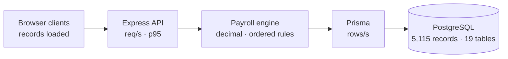
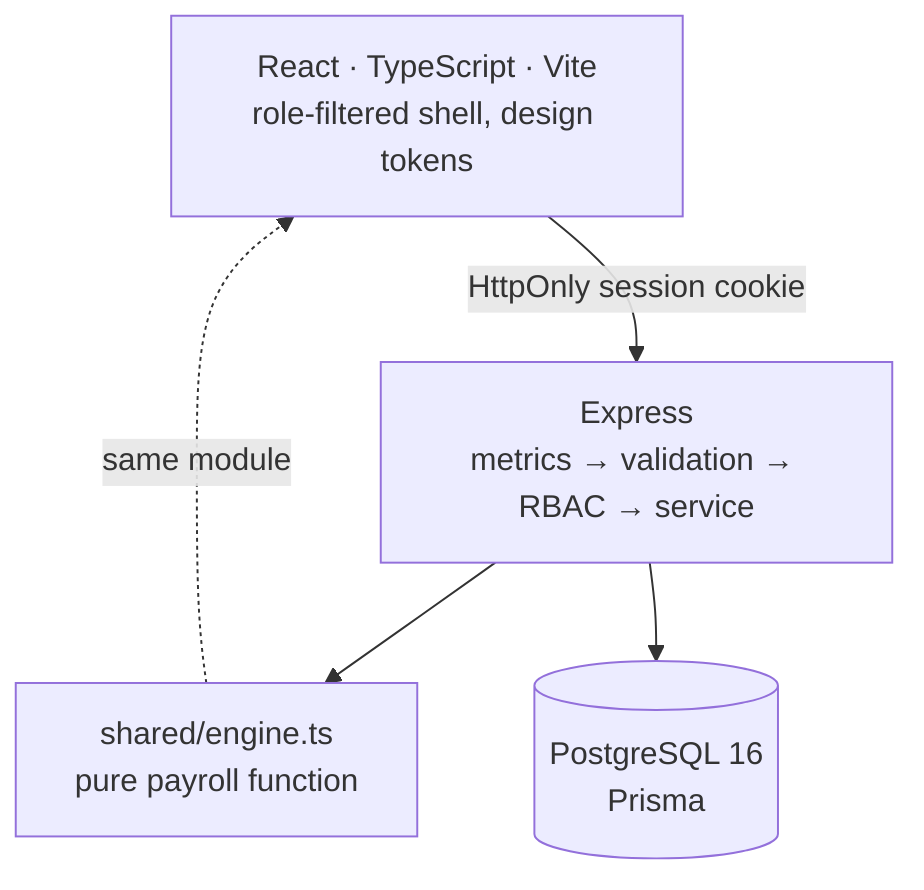

# PeoplePay360

**An HR and payroll operating system that blocks wrong payroll before money moves, and explains every rupee back to the record that produced it.**

> Odoo Hackathon 2026 · Team 804 · Maitri Kansagra and Vyas Devgna
> [MAITRI137/Hackathon_2026_804](https://github.com/MAITRI137/Hackathon_2026_804)

|                  |                                                                                                  |
| ---------------- | ------------------------------------------------------------------------------------------------ |
| **Dataset**      | 5,115 persisted records across 19 tables · 297 employees · seeded deterministically in ~3s       |
| **Correctness**  | `NUMERIC(18,2)` in the database, `decimal.js` in the engine, zero binary float in the money path |
| **Security**     | Argon2id, HttpOnly server sessions, origin-checked writes, one server-side permission matrix     |
| **Verification** | 14 integration tests · 5 real-browser journeys · lint, typecheck and production build green      |

---

## The problem with a generic payroll system

Most payroll software is a set of CRUD screens with a **Compute** button at the end. It will happily calculate a payslip from an employee who has no verified bank account, an attendance record that never closed, or two contracts that both claim the same month. The error surfaces after payment, in a spreadsheet, at the bank.

PeoplePay360 inverts that. **Payroll is a controlled workflow with a gate, not a report with a button.**





The gate is not advisory. `validate` is refused by the server while any blocking exception is open, and the button is disabled with the reason printed beside it.

---

## What we did differently

### 1. Resolving a blocker fixes the record, not a flag

There is no `resolved = true` anywhere in this codebase. Resolving _missing bank details_ writes and verifies the bank record. Resolving _missing checkout_ writes the checkout time and recomputes worked minutes from the timestamps. Resolving _duplicate payslip_ removes the duplicate row. Readiness is then recomputed from the data and simply stops finding the problem.

That single decision is what keeps readiness, the sidebar badge, the notification text, the next-best action and the validate button from ever disagreeing with each other.

### 2. Every payslip line carries its own provenance



Each line persists its rule id, version, sequence, category, the formula as it stood at compute time, the input values it actually read, and the source records behind them. A rule already used by a payslip is **versioned, never mutated**, so opening a June payslip in December still explains June's arithmetic.

The inputs are not hand-written: the formula evaluator walks the parsed expression and reports exactly which symbols it read, so the explanation cannot drift from the calculation.

### 3. Money never touches a JavaScript number

`NUMERIC(18,2)` in PostgreSQL, `decimal.js` in the engine, fixed-2dp strings on the wire. Each rule result is rounded half-up **once**, at its own boundary, so gross and net are sums of already-rounded lines and a payslip always foots. A test asserts `earnings − deductions = net` on generated payslips.

### 4. Authorisation is a server matrix, not a hidden menu

One frozen permission table drives the API guard, the navigation, the command launcher and every control. Hiding a link is never the control:

| Permission          | Employee | HR Manager | Payroll User | Payroll Manager | Admin |
| ------------------- | :------: | :--------: | :----------: | :-------------: | :---: |
| `employee.read.all` |    —     |     ✔      |      ✔       |        ✔        |   ✔   |
| `payrun.compute`    |    —     |   **—**    |      ✔       |        ✔        |   ✔   |
| `payrun.validate`   |    —     |     —      |      —       |        ✔        |   ✔   |
| `report.payroll`    |    —     |   **—**    |      ✔       |        ✔        |   ✔   |
| `ops.dashboard`     |    —     |     —      |      —       |        —        |   ✔   |

The two bold cells are the ones a reviewer probes: **an HR Manager administers no payrun and sees no confidential payroll analytics.** An end-to-end test signs in as an Employee, requests `/api/ops/metrics` directly, and asserts `403`.

### 5. The engine is one pure function, shared by every screen

Payrun totals, the payslip list, the payslip document, the simulation, the month-over-month comparison and the reports all call the same `computePayslip(context)`. No screen calculates salary independently, so no two screens can disagree. It computes **20,000 payslips in 0.8 seconds**, measured.

### 6. Live operations you can actually watch

An admin-only console draws the real request path on a canvas — browser, API, payroll engine, Prisma, PostgreSQL — with packets emitted at the rate the server reports and a node flash on each arrival, alongside table row counts, database round-trip time, latency percentiles and busiest routes.



Everything on it is measured, never simulated, and the payload is deliberately anonymous — it answers _what is the system doing_, never _what is this person doing_. One canvas, one animation frame loop, data read from a ref: React never re-renders per frame, so the console cannot become the load it is measuring.

### 7. Productivity built into the grammar, not bolted on

`Ctrl/Cmd + K` opens a role-aware launcher generated from live data. Contextual sidecars inspect a record without losing the current workflow. Batch actions preview affected records and conflicts before committing. A deterministic next-best-action engine names the single most useful thing to do and explains why. Delivery failures land in a persisted outbox and can never alter a computed amount.

---

## Architecture

A modular monolith: one Node process serving the API, one static React bundle, one PostgreSQL database.



The payroll engine, the money helpers, the permission matrix and the date arithmetic live in `shared/` and are imported by **both** the browser and the server, so the client can preview a calculation using exactly the code the server will run.

| Path      | Contents                                                                      |
| --------- | ----------------------------------------------------------------------------- |
| `shared/` | Payroll engine, restricted formula evaluator, money, dates, permission matrix |
| `server/` | Express API, auth and RBAC, metrics registry, ops telemetry, Prisma access    |
| `src/`    | React app — shell, design system, feature screens, client store               |
| `prisma/` | Schema, migrations, deterministic seed and the record-budget scale generator  |
| `e2e/`    | Playwright journeys, including the privacy boundary                           |
| `docs/`   | Build contract, requirement ledger, release gates                             |

---

## Quick start

**Prerequisites:** Node.js 20.19+, npm, and PostgreSQL 16 (Docker Compose is included).

```sh
npm install
cp .env.example .env            # PowerShell: Copy-Item .env.example .env
npm run docker:up               # or point DATABASE_URL at any PostgreSQL 16
npm run db:migrate
npm run db:seed                 # ~3s → 5,115 records, prints the per-table totals
npm run dev:server              # API on :3000
npm run dev                     # app on :5173, proxies /api
```

Sign in with any seeded persona — the sign-in screen lists them and fills the form, but you still authenticate and the server still decides what you may see.

| Persona            | Email                          | Password            |
| ------------------ | ------------------------------ | ------------------- |
| HR Payroll Manager | `maitri.shah@peoplepay360.com` | `PeoplePay360!2026` |
| HR Manager         | `priya.desai@peoplepay360.com` | `PeoplePay360!2026` |
| HR Payroll User    | `isha.mehta@peoplepay360.com`  | `PeoplePay360!2026` |
| Employee           | `aarav.patel@peoplepay360.com` | `PeoplePay360!2026` |
| Administrator      | `admin@peoplepay360.com`       | `PeoplePay360!2026` |

`npm run db:reset` restores the exact demo state at any moment.

---

## The eight-minute demo

1. **Land as the payroll manager.** Not a KPI wall — a control room: _September 2026 · COMPUTED · 83% ready · 4 blockers_ and one primary action.
2. **Resolve a blocker.** Save Rahul's real bank record. The card clears, readiness climbs, the badge decrements. Clear the rest; readiness reaches 100% and the next-best action changes by itself to _Validate_.
3. **Try to break it.** Before that, _Validate_ was refused with a specific reason. Create an overlapping contract and the error names the contract it collides with.
4. **Validate → Mark paid.** The stepper advances honestly and the report KPI relabels from _Estimated Net Payroll_ to _Total Net Salary Paid_.
5. **Explain a payslip.** `₹11,000 ← HRA v2 ← BASIC × 20% ← BASIC ₹55,000 ← Contract CT-202`, with the contract opening in a sidecar.
6. **Prove the boundary.** Switch to the Employee: own data only. Then `curl` another person's payroll and get `403`.
7. **Watch it run.** Open the admin console: packets moving through the real request path, 5,115 records, live latency, busiest routes.
8. **Degrade on purpose.** Break mail delivery: payslips fail into the outbox, payroll amounts are untouched.

---

## Verification

```sh
npm run lint && npm run typecheck && npm test && npm run build && npm run test:e2e
```

| Gate                                                    | Result                                                                                 |
| ------------------------------------------------------- | -------------------------------------------------------------------------------------- |
| ESLint · TypeScript (app + server)                      | clean                                                                                  |
| Integration tests (Vitest + Supertest, real PostgreSQL) | 14 passed                                                                              |
| Browser journeys (Playwright)                           | 5 passed — sign-in, persona switch, employee privacy, mobile navigation, ops telemetry |
| Production build (web + server)                         | clean                                                                                  |

The suite asserts the _dataset contract_ rather than frozen numbers: one contract and one bank record per employee, exactly one seeded bank blocker, a total of at least 5,000 rows, and payslips that foot. Scaling the seed cannot silently weaken it.

Also asserted: no response ever serialises a password hash, an employee cannot reach payroll or operations endpoints, and no page scrolls horizontally at 390 px.

---

## Documentation

- [`docs/IMPLEMENTATION_PLAN.md`](docs/IMPLEMENTATION_PLAN.md) — the full build contract
- [`docs/plan/`](docs/plan/) — architecture, scale design, data model, backlog, ops console, demo script
- [`docs/plan/feature-matrix.csv`](docs/plan/feature-matrix.csv) — 258 requirement rows with evidence status
- [`docs/checklists/release-gates.md`](docs/checklists/release-gates.md) — exit criteria
