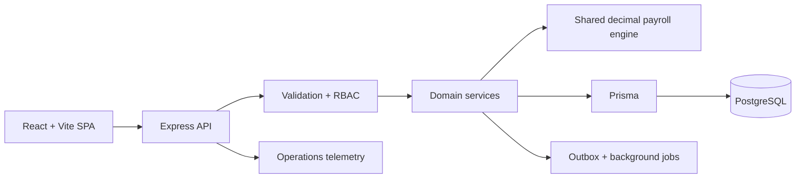

# PeoplePay360

PeoplePay360 is an explainable HR and payroll operating system built for the Odoo Hackathon 2026. It turns employee, contract, attendance, leave, and salary-policy data into a controlled payroll workflow where every rupee can be traced back to its source.

> Team 804 · Maitri Kansagra and Vyas Devgna · [Hackathon repository](https://github.com/MAITRI137/Hackathon_2026_804)

## Why it stands out

- **Exception-first payroll:** real data blockers prevent validation before money moves.
- **Explainable payslips:** each line retains its rule version, formula, inputs, and source references.
- **One coherent state model:** headcount, payroll totals, readiness, reports, and notifications derive from the same records.
- **Five role-aware experiences:** Employee, HR Manager, HR Payroll User, HR Payroll Manager, and Administrator.
- **Operator productivity:** command launcher, contextual sidecars, approval inbox, batch previews, smart defaults, and next-best actions.
- **Responsive by task, not by subtraction:** authorized workflows remain available on desktop, tablet, and phone.
- **Visible engineering:** an admin-only operations dashboard presents system, database, network, and client activity without exposing personal data.

## Current implementation

The repository currently contains a complete interactive frontend prototype backed by a deterministic in-memory domain store, a shared decimal payroll engine, a strict TypeScript/Express foundation, and the initial PostgreSQL/Prisma runtime. The next milestones replace the prototype store with authenticated, persisted APIs while preserving the same domain contracts.

Implemented frontend surfaces include:

- Role-specific dashboards and permission-filtered navigation
- Employees, employee detail, contracts, and working schedules
- Attendance records, calendar, corrections, and regularization proposals
- Time-off requests, balances, allocations, team calendar, and approvals
- Payroll control room, readiness, blockers, lifecycle, and delivery outbox
- Payslip history, printable document, and calculation provenance
- Salary structures and versioned rule editing
- Read-only payroll simulation using the production calculation engine
- Filtered reports with accessible chart tables and CSV export
- Documents, audit trail, users and roles, settings, and system health

See [`docs/IMPLEMENTATION_PLAN.md`](docs/IMPLEMENTATION_PLAN.md) for the full build contract and [`docs/plan/feature-matrix.csv`](docs/plan/feature-matrix.csv) for requirement-level evidence tracking.

## Quick start

### Prerequisites

- Node.js 20.19 or newer
- npm 10 or newer
- Docker Desktop for PostgreSQL-backed server work

### Frontend demo

```bash
git clone https://github.com/MAITRI137/Hackathon_2026_804.git
cd Hackathon_2026_804
npm ci
npm run dev
```

Open [http://localhost:5173](http://localhost:5173). Use the role switcher at the bottom of the sidebar to exercise each experience. The frontend demo is deterministic and does not need an internet connection after dependencies are installed.

### Full local runtime

```bash
copy .env.example .env
npm run docker:up
npm run db:generate
npm run db:push
npm run dev:server
```

In a second terminal, run `npm run dev`. The API health endpoint is available at [http://localhost:3000/api/health](http://localhost:3000/api/health).

On macOS or Linux, replace `copy .env.example .env` with `cp .env.example .env`.

## Demo flow

1. Start as **HR Payroll Manager** and open September payroll.
2. Resolve the missing bank detail, missing checkout, and duplicate payslip blockers.
3. Watch readiness and the next-best action update from the underlying records.
4. Compute, validate, and mark the payrun paid.
5. Open a payslip and inspect the formula and source chain for each component.
6. Switch to **Employee** and verify that attendance, leave, contracts, documents, and payslips are self-scoped.
7. Switch to **Administrator** and open System Health for the calm live-operations view.

The full eight-minute judging script is documented in [`docs/plan/09-testing-timeline-demo.md`](docs/plan/09-testing-timeline-demo.md#14-demo-script-8-minutes).

## Architecture



The target architecture is a modular monolith: one deployable API and worker process, one PostgreSQL database, and one static React bundle. This keeps transactions, authorization, operations, and deployment understandable while supporting the 5,000-employee design envelope.

Important invariants:

- Money crosses boundaries as decimal strings and is calculated with `decimal.js`.
- Salary rules are sequence-driven and versioned after use.
- A payrun follows `DRAFT → COMPUTED → VALIDATED → PAID`.
- Blocking exceptions must reach zero before validation.
- Resolving a blocker changes its source record; there is no independent “resolved” flag.
- Paid payroll history is designed to be immutable.
- Client-side navigation filtering is usability; server-side RBAC is authorization.

## Project structure

```text
prisma/              Database schema and migrations
server/src/          Express runtime, middleware, routes, and domain modules
shared/              Money, date, formula, permission, and payroll contracts
src/                 React application, state, design primitives, and features
e2e/                 Playwright acceptance tests
docs/plan/           Architecture, backlog, automation, ops, and demo plan
```

## Quality gates

```bash
npm run typecheck
npm run lint
npm run test
npm run build
npm run test:e2e
```

Database-backed tests require PostgreSQL. Start it with `npm run docker:up` before running the full suite.

## Design system

PeoplePay360 is deliberately light-only and uses:

- Brand `#2274A5`
- Accent `#6DA2C2`
- Gold warning semantics
- Restrained green success and red error semantics
- Lucide icons only
- A 4 px spacing grid, visible focus states, coarse-pointer touch targets, and reduced-motion support

Charts expose every value by hover, keyboard focus, and tap, and include a table representation for assistive technology and precise inspection.

## Security and privacy direction

The server roadmap includes HttpOnly sessions, Argon2id password hashing, origin checks on mutations, Zod validation, row-level scoping, idempotency keys, optimistic concurrency, and append-only audit records. Salary and payroll analytics are unavailable to HR Manager and Employee roles by design; employee self-service is restricted to the signed-in employee’s records.

## License

Created for Odoo Hackathon 2026, Team 804. All rights reserved by the project authors unless a separate license is added.
