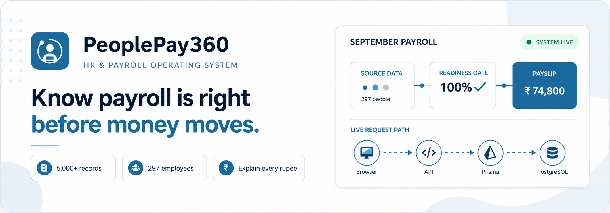
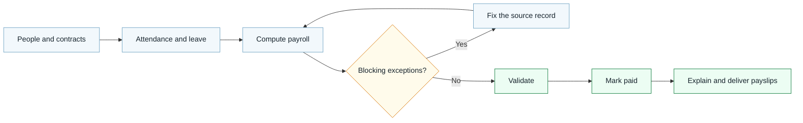
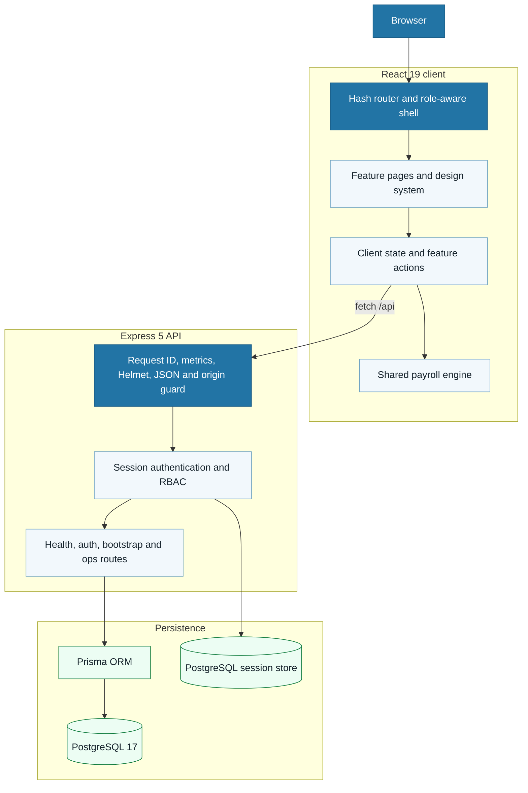
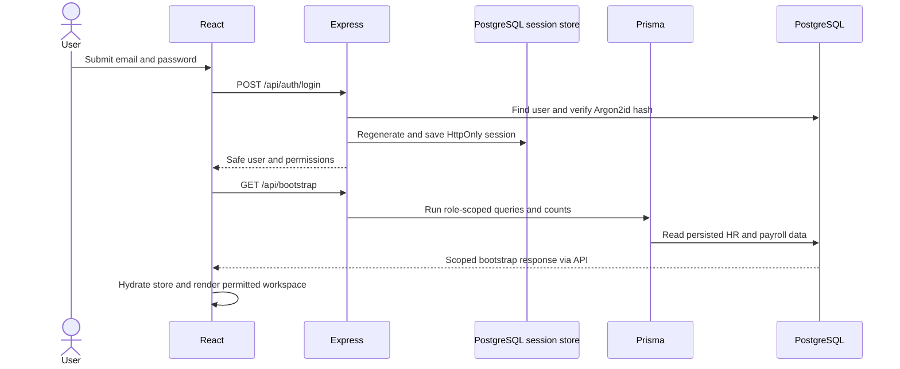

<p align="center">
  <strong>An explainable HR and payroll operating system built for confident payroll decisions.</strong><br />
  Odoo Hackathon 2026 · Team 804 · Maitri Kansagra &amp; Vyas Devgna
</p>

<p align="center">
  
  
  
  
  
</p>

<p align="center">
  <a href="#the-product">Product</a> ·
  <a href="#why-it-is-different">Differentiators</a> ·
  <a href="#architecture">Architecture</a> ·
  <a href="#run-it-locally">Run locally</a> ·
  <a href="#demo-script">Demo</a> ·
  <a href="#verification">Verification</a>
</p>

## The product

Payroll errors rarely begin in payroll. They begin in a missing bank record, an overlapping contract, an open attendance punch, or a rule that nobody can explain after it changes.

PeoplePay360 brings those inputs into one coherent workspace and makes correctness visible **before** payment:

| From opening the app…                    | …to completing payroll                                    |
| ---------------------------------------- | --------------------------------------------------------- |
| Sign in as a real seeded persona         | Receive a server-scoped dataset for that role             |
| Review one calm, role-specific dashboard | Follow the system's next recommended action               |
| Compute the selected payrun              | See readiness, blockers, warnings and totals together     |
| Resolve each exception at its source     | Watch readiness update from the corrected data            |
| Validate and mark the run paid           | Inspect or deliver explainable payslips                   |
| Open System Health as an administrator   | Watch measured traffic, reads, latency and database state |

### Submission at a glance

| Area                    | What is implemented                                                                    |
| ----------------------- | -------------------------------------------------------------------------------------- |
| **Scale**               | Deterministic seed with **297 employees** and **5,115 persisted operational records**  |
| **Payroll correctness** | Decimal arithmetic, ordered rules, per-line rounding and reconciliation checks         |
| **Control**             | Readiness scoring, blocking exceptions, warnings and guarded workflow transitions      |
| **Explainability**      | Rule, formula, evaluated inputs and source references on every payslip line            |
| **Security**            | Argon2id passwords, PostgreSQL-backed HttpOnly sessions, origin checks and server RBAC |
| **Operations**          | Admin-only live node graph backed by real API, process and database measurements       |
| **Quality**             | 15 integration tests and 8 Playwright browser journeys in the repository               |

## Why it is different

### Generic payroll vs PeoplePay360

| Generic payroll software                     | PeoplePay360                                               |
| -------------------------------------------- | ---------------------------------------------------------- |
| Computes first and surfaces bad inputs later | Runs a readiness gate before validation                    |
| Marks an exception “resolved”                | Fixes the underlying bank, attendance or payslip record    |
| Shows only a final amount                    | Traces every line to its rule, formula, inputs and sources |
| Hides links as a substitute for security     | Enforces the same role matrix on server endpoints          |
| Uses floating-point numbers casually         | Uses PostgreSQL `NUMERIC(18,2)` and `decimal.js` for money |
| Gives everyone the same dashboard            | Adapts navigation, actions and data scope to each persona  |
| Offers a static health badge                 | Draws measured requests, reads and database activity live  |



### Four decisions that make the product credible

1. **Readiness is derived, not manually toggled.** Resolving a blocker changes its source data; the next readiness calculation simply stops finding that problem.
2. **Payslips preserve provenance.** Each line keeps the rule version, sequence, formula, inputs and source references that produced its amount.
3. **Money has one safe path.** Database decimals become fixed-precision `Decimal` values, each rule rounds once, and net pay reconciles from already-rounded lines.
4. **Operational visibility is privacy-safe.** The admin console reports aggregate traffic and table counts, never names, emails, salaries or addresses.

## Experience by role

| Persona             | Designed experience                                                                    |
| ------------------- | -------------------------------------------------------------------------------------- |
| **Employee**        | Own attendance, leave, documents and payslips only                                     |
| **HR Manager**      | People operations and approvals without payroll administration or confidential reports |
| **Payroll User**    | Prepare and compute payroll without final approval authority                           |
| **Payroll Manager** | Resolve blockers, validate, pay, report and deliver                                    |
| **Administrator**   | User access, settings and live system health                                           |

The navigation, command launcher and page controls use the same permission vocabulary as the API. The server remains the authority for `/api/bootstrap` and `/api/ops/metrics`; a hidden menu item is never treated as access control.

## Feature tour

<table>
  <tr>
    <td width="50%" valign="top">
      <h3>Payroll control room</h3>
      Period state, readiness, blockers, totals and the single next-best action are visible together—without turning the page into a KPI wall.
    </td>
    <td width="50%" valign="top">
      <h3>Exception Centre</h3>
      Blocking and warning items are grouped by source. Resolution flows validate bank, attendance and duplicate-payslip corrections before applying them.
    </td>
  </tr>
  <tr>
    <td width="50%" valign="top">
      <h3>Explainable payslips</h3>
      An amount can be expanded into its salary rule, formula, actual evaluated inputs and originating contract—useful for employees, payroll teams and audits.
    </td>
    <td width="50%" valign="top">
      <h3>Live System Health</h3>
      An animated node graph follows Browser → API → Prisma → PostgreSQL while adjacent panels show live request rate, records read, latency percentiles and table volume.
    </td>
  </tr>
  <tr>
    <td width="50%" valign="top">
      <h3>Role-aware productivity</h3>
      <kbd>Ctrl</kbd>/<kbd>⌘</kbd> + <kbd>K</kbd> opens a command launcher whose destinations and actions change with the signed-in persona.
    </td>
    <td width="50%" valign="top">
      <h3>Reports and simulation</h3>
      Payroll trends, department comparisons, downloadable reports and wage/leave scenarios all reuse the same calculation primitives.
    </td>
  </tr>
</table>

## Architecture

PeoplePay360 is a TypeScript full-stack application with two development processes: Vite serves the React client, and Express serves `/api`. The client talks to the database only through that API; PostgreSQL persists application and session state.



### What happens after sign-in



### API surface

| Method | Endpoint             | Access                     | Purpose                                                          |
| ------ | -------------------- | -------------------------- | ---------------------------------------------------------------- |
| `GET`  | `/api/health`        | Public                     | Process and database readiness                                   |
| `POST` | `/api/auth/login`    | Public                     | Validate credentials, apply lockout controls and start a session |
| `GET`  | `/api/auth/me`       | Authenticated              | Restore a valid session and return safe user data                |
| `POST` | `/api/auth/logout`   | Authenticated              | Destroy the server session and clear its cookie                  |
| `POST` | `/api/auth/password` | Authenticated              | Verify the old password, hash the new one and rotate the session |
| `GET`  | `/api/bootstrap`     | Authenticated, role-scoped | Load the caller's permitted working set and SQL aggregates       |
| `GET`  | `/api/ops/metrics`   | Administrator only         | Return anonymous live application and database telemetry         |

> [!IMPORTANT]
> **Current implementation boundary:** authentication, session state, bootstrap reads, role scoping, health and ops telemetry are server-backed. The interactive HR/payroll edit flows operate on the hydrated client snapshot for the hackathon demonstration; they do not yet persist through write APIs. Reloading restores the seeded database state. Production hardening should add transactional command endpoints, optimistic concurrency, audit persistence and background delivery workers.

### Repository map

```text
├── src/
│   ├── app/          # Application shell, router, navigation and command launcher
│   ├── features/     # Auth, people, time, payroll, reports, admin and ops pages
│   ├── store/        # Hydrated client state, selectors and demo business actions
│   ├── styles/       # PeoplePay360 tokens and responsive component styles
│   └── ui/           # Reusable forms, tables, charts, overlays and feedback
├── shared/           # Payroll engine, types, dates, money and permissions
├── server/src/       # Express app, middleware, routes, RBAC and metrics
├── prisma/           # 21-model schema, migrations and deterministic seed generator
├── e2e/              # Playwright user journeys
└── docs/              # Plan, evidence matrix, references and release gates
```

## Technology choices

| Technology                   | Why it fits this project                                                                               |
| ---------------------------- | ------------------------------------------------------------------------------------------------------ |
| **React 19 + TypeScript**    | Component-driven role experiences with compile-time contracts across UI, API payloads and payroll data |
| **Vite 8**                   | Fast development feedback and an optimized client build                                                |
| **React Router 7**           | Nested application routes, parameterized employee/payslip pages and permission wrappers                |
| **Express 5**                | A small, explicit HTTP boundary for sessions, RBAC, bootstrap data and telemetry                       |
| **Prisma 6**                 | Typed PostgreSQL queries, transactions, relations and repeatable migrations                            |
| **PostgreSQL 17**            | Relational integrity and exact numeric storage for contracts, payroll and audit data                   |
| **Argon2 + express-session** | Memory-hard password hashing and revocable server-side sessions instead of browser-stored auth tokens  |
| **decimal.js + mathjs**      | Precise money operations and a restricted formula evaluator for salary rules                           |
| **Zod**                      | Runtime validation at authentication and password-change boundaries                                    |
| **Vitest + Supertest**       | Fast integration checks against the real Express application and PostgreSQL data                       |
| **Playwright**               | Real-browser verification of sign-in, privacy, responsive navigation, explainability and telemetry     |

## Run it locally

### Prerequisites

- Node.js **20.19+** and npm **10+**
- Docker Desktop, or a local PostgreSQL instance

### 1. Install and configure

```bash
git clone https://github.com/MAITRI137/Hackathon_2026_804.git
cd Hackathon_2026_804
npm ci
```

```powershell
Copy-Item .env.example .env
```

On macOS or Linux, use `cp .env.example .env` instead.

### 2. Start PostgreSQL and seed the demo

```bash
npm run docker:up
npm run db:migrate
npm run db:seed
```

The seed is deterministic: rerunning `npm run db:reset` restores the same submission story.

### 3. Start both development processes

Terminal one:

```bash
npm run dev:server
```

Terminal two:

```bash
npm run dev
```

Open [http://localhost:5173](http://localhost:5173). Vite proxies `/api` to Express on port `3000`.

<details>
<summary><strong>Demo credentials</strong></summary>

All seeded personas use password `PeoplePay360!2026`.

| Persona            | Email                          |
| ------------------ | ------------------------------ |
| HR Payroll Manager | `maitri.shah@peoplepay360.com` |
| HR Manager         | `priya.desai@peoplepay360.com` |
| HR Payroll User    | `isha.mehta@peoplepay360.com`  |
| Employee           | `aarav.patel@peoplepay360.com` |
| Administrator      | `admin@peoplepay360.com`       |

</details>

<details>
<summary><strong>Useful development commands</strong></summary>

| Command              | Purpose                                  |
| -------------------- | ---------------------------------------- |
| `npm run dev`        | Start the Vite client                    |
| `npm run dev:server` | Start the Express API with file watching |
| `npm run db:seed`    | Load the deterministic demo dataset      |
| `npm run db:reset`   | Reset migrations and restore the demo    |
| `npm run db:studio`  | Inspect PostgreSQL through Prisma Studio |
| `npm run lint`       | Run ESLint across the repository         |
| `npm run typecheck`  | Type-check client and server             |
| `npm test`           | Run the 15 integration tests             |
| `npm run test:e2e`   | Run the 8 browser journeys               |
| `npm run build`      | Produce the client and server builds     |

</details>

## Demo script

Use this focused route for an evaluator:

1. **Sign in as Payroll Manager.** Point out the active period, readiness score, blocking count and primary action.
2. **Open Exception Centre.** Resolve a bank or attendance problem and show that the source record—not a cosmetic flag—changes.
3. **Return to Payroll.** Show the recalculated readiness and guarded transition from compute to validate to paid.
4. **Open a payslip.** Expand one line and trace amount → rule → formula → inputs → contract.
5. **Switch to Employee.** Show that the same product becomes a private self-service workspace.
6. **Switch to Administrator → System Health.** Watch packets cross the live node graph and compare request rate, records read, latency and table counts.
7. **Finish with Reports.** Explain how the same payroll results drive summaries and exports instead of being recalculated screen by screen.

## Verification

Run the complete local quality gate:

```bash
npm run lint
npm run typecheck
npm test
npm run build
npm run test:e2e
```

The tests cover:

- session login, logout, lockout-safe errors and credential hygiene;
- employee self-scope and HR/payroll permission boundaries;
- the deterministic 5,000+ record database contract;
- payroll calculation and payslip reconciliation from a server bootstrap snapshot;
- real-browser login, persona switching and mobile navigation;
- payslip and salary-change explainability;
- scoped report generation and admin-only telemetry.

## Security model

- Passwords are Argon2id hashes; a dummy hash keeps unknown-user timing closer to wrong-password timing.
- Sessions live in PostgreSQL and reach the browser only as a rolling, HttpOnly, SameSite cookie.
- Successful login and password change regenerate the session to limit fixation risk.
- State-changing requests are checked against the configured application origin.
- Authentication responses explicitly select safe user fields and never serialize password hashes or lockout internals.
- Role-scoped bootstrap queries prevent employees from receiving another person's HR or payroll rows.
- Operations metrics require `ops.dashboard` and contain aggregate infrastructure data only.

> [!WARNING]
> The included credentials are demonstration accounts. Replace the session secret and all seeded passwords before any deployment beyond a local judging environment.

## Design system and accessibility

The README mirrors the product's light visual system: PeoplePay blue `#2274A5`, steel accent `#6DA2C2`, soft `#F4F7F9` surfaces, restrained status colors and a four-pixel spacing rhythm.

The application adds semantic headings and landmarks, keyboard-visible controls, reduced-motion support, responsive navigation, print styles, reusable loading/empty/error states and touch-friendly targets. The Playwright suite checks the primary mobile navigation path, and the animated ops graph respects `prefers-reduced-motion`.

## Known limits and the production path

This is a high-fidelity hackathon product, not a finished payroll compliance platform. The next engineering milestones are deliberately clear:

1. Move client-side HR/payroll commands behind validated, transactional API endpoints.
2. Add optimistic locking/idempotency to payrun transitions and record edits.
3. Persist every business mutation and audit event atomically.
4. Add a job queue for payslip generation/delivery with a durable outbox and retries.
5. Add jurisdiction-specific tax/compliance rules and formal rule approval/version migration.
6. Serve the production web bundle behind the API or a reverse proxy and add CI/CD.
7. Add load, accessibility and security regression gates to the existing integration/browser suite.

## Project documentation

- [`docs/IMPLEMENTATION_PLAN.md`](docs/IMPLEMENTATION_PLAN.md) — delivery contract and implementation blueprint
- [`docs/plan/`](docs/plan/) — architecture, scale, data model, backlog, ops console and demo plan
- [`docs/plan/feature-matrix.csv`](docs/plan/feature-matrix.csv) — requirement-to-evidence ledger
- [`docs/checklists/release-gates.md`](docs/checklists/release-gates.md) — submission exit criteria
- [`prisma/schema.prisma`](prisma/schema.prisma) — relational data model
- [`shared/engine.ts`](shared/engine.ts) — payroll calculation core

---

<p align="center">
  <strong>PeoplePay360</strong><br />
  Correct before payment. Explainable after it.<br /><br />
  Built by Team 804 for Odoo Hackathon 2026.
</p>
